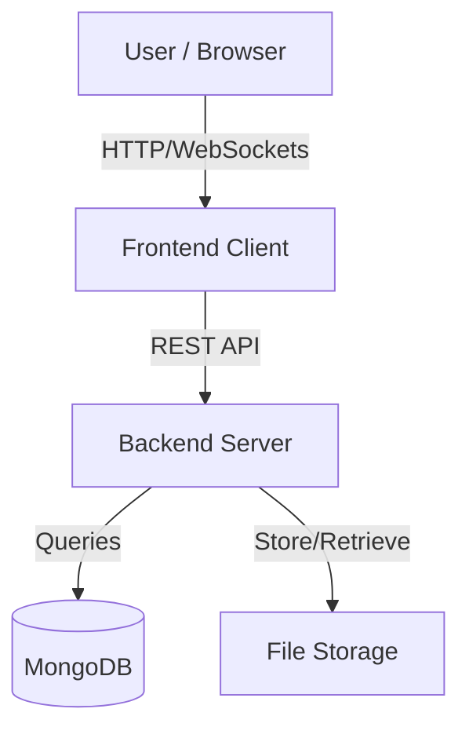

# System Architecture

AIVA is built as a modular, containerized application consisting of three main components.

## High-Level Overview

## Components

### 1. Frontend Client
- **Tech Stack**: React, Vite, Tailwind CSS.
- **Role**: Provides the user interface for task management, chat, and settings.
- **Hosting**: Served via Nginx in production Docker images, or Vite dev server during development.
- **Features**: Real-time updates, responsive design, dark mode.

### 2. Backend Server
- **Tech Stack**: Node.js, Express.
- **Role**: The brain of AIVA. Handles API requests, business logic, AI processing, and database interactions.
- **Key Services**:
    - **Auth Service**: JWT-based authentication.
    - **Task Engine**: CRUD operations for tasks and habits.
    - **AI Service**: Integration with LLMs for chat and intent recognition.
    - **Sync Service**: Google Calendar/Tasks synchronization.

### 3. Database
- **Tech Stack**: MongoDB.
- **Role**: Persistent storage for all user data (users, tasks, notes, workspaces).
- **Persistence**: Data is persisted using Docker volumes so it survives container restarts.

## Communication
- **API**: The frontend communicates with the backend via a RESTful API.
- **Real-time**: Socket.IO is used for real-time features like notifications and chat updates.
